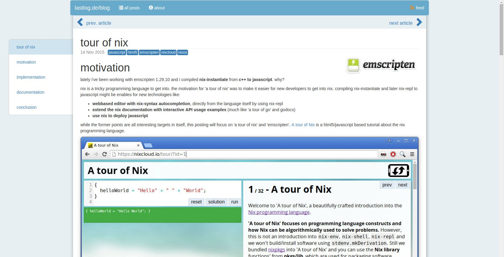

# motivation

# what
**pankat** is a **static blog generator** inspired by [joey hess's ikiwiki](https://ikiwiki.info/users/joey/).



notable features:

* writing / reading aid
  * **markdown** syntax for writing articles
  * **table of contents** using jquery.tocify.min.js
  * **dynamic page anchors** (similar to anchor.js)
  * `[[!draft]]` mode support
  * **live updates** of article changes via websocket using **file system changes monitoring** in the documents folder
  * full git support
* minimalistic approach:
  * **pankat instance creates static html** documents
  * uses **sqlite database**
  * manage **documents with git**
  * hosting of documents with **nginx**
* **out of source** document builds

* full **theme-support**, asset folder contains
  * templates
  * css
  * js
  * fonts

# run

    nix develop
    just run

this command executes the WASM build, copies artefacts and starts the webserver. 

## configuration file

pankat supports:

* **command line** (see `pankat --help` for details)
* **environment variables** (most likely only used for these)
  * PANKAT_JWT_SECRET
  * PANKAT_ADMIN_PASSWORD
* config file `pankat.toml`
  * see the [pankat.toml](pankat.toml) for documentation

# architecture


# supported platforms

* linux (with nix)
* windows (untested)

## dependencies

* rust
* pandoc 3.x
* (see flake.nix dependencies)

# sqlite database

used for:

* storing parsed article structure
* article cache (so we don't need to run pandoc each tim)

pankat uses `diesel` to query the database.

## extend schema

    diesel print-schema > src/db/schema.rs

# development

* run the tests `just test`
* `just run`, then connect to localhost:5000 with any webbrowser
* you can delete **documents/output** and **documents/pankat.sqlite** then start `pankat` again
* use the `documents/example.de` documents, theme contributions are welcome

# deployment

currently: `just run`, then `cp target/debug/pankat /home/pankat-app/pankat`.

ideally: `just zig`, then `cp target/release/pankat /home/pankat-app/pankat` and later using a nix expression to build and use a read-only /nix/store for both pankat binary and artifacts.

## directory structure

```bash
/etc/nixos> ls /home/pankat-app/
╭───┬──────────────────────────────┬──────┬──────────┬─────────────╮
│ # │             name             │ type │   size   │  modified   │
├───┼──────────────────────────────┼──────┼──────────┼─────────────┤
│ 0 │ /home/pankat-app/documents   │ dir  │    108 B │ 8 hours ago │
│ 1 │ /home/pankat-app/pankat      │ file │ 117.6 MB │ 9 hours ago │
│ 2 │ /home/pankat-app/pankat.toml │ file │    948 B │ 9 hours ago │
╰───┴──────────────────────────────┴──────┴──────────┴─────────────╯

/etc/nixos> ls /home/pankat-app/documents/
╭───┬────────────────────────────────────────────┬──────┬─────────┬─────────────╮
│ # │                    name                    │ type │  size   │  modified   │
├───┼────────────────────────────────────────────┼──────┼─────────┼─────────────┤
│ 0 │ /home/pankat-app/documents/assets          │ dir  │    58 B │ 9 hours ago │
│ 1 │ /home/pankat-app/documents/blog.lastlog.de │ dir  │    48 B │ a day ago   │
│ 2 │ /home/pankat-app/documents/lastlog.de      │ dir  │    10 B │ a day ago   │
│ 3 │ /home/pankat-app/documents/output          │ dir  │ 11.1 kB │ 8 hours ago │
│ 4 │ /home/pankat-app/documents/pankat.sqlite   │ file │  2.4 MB │ 8 hours ago │
│ 5 │ /home/pankat-app/documents/wasm            │ dir  │   188 B │ 9 hours ago │
╰───┴────────────────────────────────────────────┴──────┴─────────┴─────────────╯
```

# configuration.nix

this config makes sure that nginx does all the serving in production and only the /api/ws is from `pankat`. yet
live-updates are properly served and html documents in `documents/output` are properly updated on fs-changes.

```nix
users.users = {
  pankat-app = {
    isSystemUser = true;
    home = "/pankat-app";
    group = "pankat-app";
    description = "pankat app users";
  };
};
users.groups.pankat-app = {};

security.acme = {
  acceptTerms = true;
  defaults.email = "info@nixcloud.io";
};

services.nginx = {
  enable = true;
  recommendedGzipSettings = true;
  recommendedOptimisation = true;
  virtualHosts = {
    lastlogblog = {
      serverName = "lastlog.de";
      serverAliases = [ "www.lastlog.de" ];
      forceSSL = true;
      enableACME = true;
      extraConfig = ''
        location /blog/api/ws {
          proxy_pass http://127.0.0.1:5000;
          proxy_set_header Host $host;
          proxy_http_version 1.1;
          proxy_set_header Upgrade $http_upgrade;
          proxy_set_header Connection "upgrade";
          proxy_read_timeout 86400;
        }
        location ^~ /blog/posts/ {
          alias /pankat-app/documents/blog.lastlog.de/posts/;
          autoindex on;
        }
        location ^~ /blog/media/ {
          alias /pankat-app/documents/blog.lastlog.de/media/;
          autoindex on;
        }
        location ^~ /blog/assets/ {
          alias /pankat-app/documents/assets/;
          autoindex on;
        }
        location ^~ /blog/wasm/ {
          alias /pankat-app/documents/wasm/;
          autoindex on;
        }
        location ^~ /blog/ {
          alias /pankat-app/documents/output/;
          autoindex on;
        }
        location = / {
          return 301 https://lastlog.de/blog/index.html;
        }
        location = /blog {
          return 301 https://lastlog.de/blog/index.html;
        }
      '';
    };
  };
};
```
# commands

```bash
setfacl -d -m u:joachim:rwx /pankat-app
setfacl -R -m u:joachim:rx /pankat-app
setfacl -R -m u:nginx:rx /pankat-app
setfacl -d -m u:nginx:rx /pankat-app
```