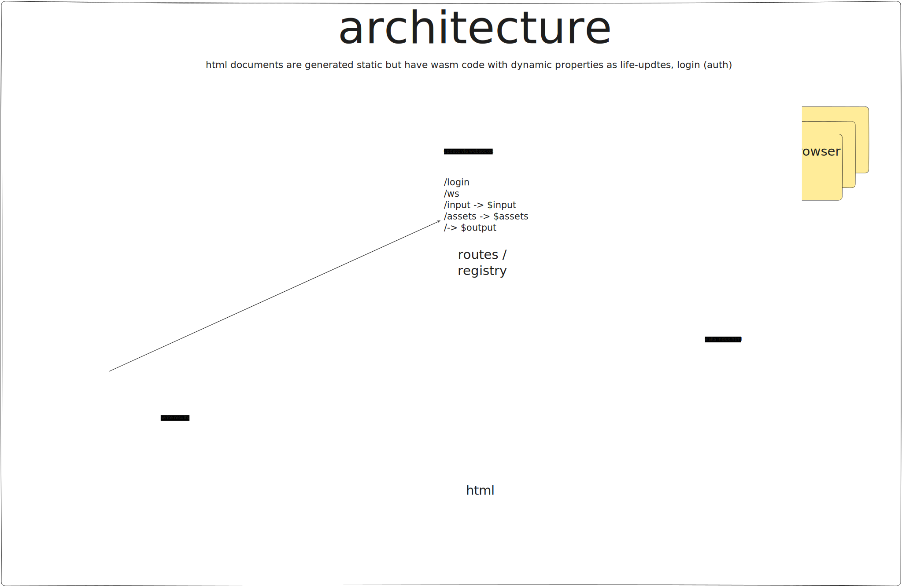

pankat-replit is a reimplementation of https://github.com/nixcloud/pankat in rust (conversion from go).

the roadmap is here:

https://github.com/nixcloud/pankat/issues/7

# run

cargo run -- --input documents/blog.lastlog.de/ --output documents/output/ --assets documents/assets/ --database documents/

# architecture

